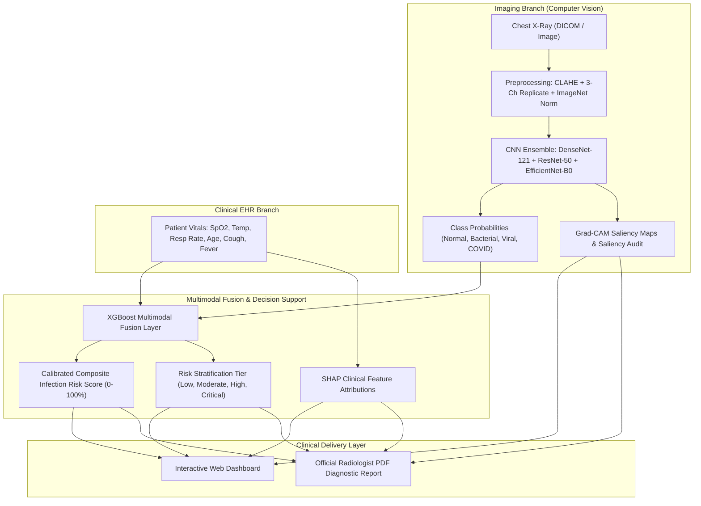

# 🫁 PneumoScan AI — Chest X-Ray Pneumonia Detection & Multimodal Clinical Decision Support

[](https://www.python.org/)
[](https://pytorch.org/)
[](https://fastapi.tiangolo.com/)
[](https://xgboost.readthedocs.io/)
[]()
[]()

> **PneumoScan AI** is an end-to-end medical deep learning and clinical decision support system designed to assist radiologists in detecting, categorizing, and triaging thoracic infections (**Normal**, **Bacterial Pneumonia**, **Viral Pneumonia**, and **COVID-19**).
> 
> The system addresses critical radiography challenges: **patient-level data leakage**, **severe class imbalance**, **shortcut learning**, and **multimodal clinical EHR fusion**.

---

## 📑 Table of Contents
1. [The Clinical Problem](#1-the-clinical-problem)
2. [End-to-End System Architecture](#2-end-to-end-system-architecture)
3. [Critical Radiography Data Issues](#3-critical-radiography-data-issues)
4. [Preprocessing & Medically Realistic Augmentation](#4-preprocessing--medically-realistic-augmentation)
5. [Deep Learning Backbones & Two-Phase Fine-Tuning](#5-deep-learning-backbones--two-phase-fine-tuning)
6. [Handling Class Imbalance](#6-handling-class-imbalance)
7. [Clinical Evaluation & Calibration](#7-clinical-evaluation--calibration)
8. [Multimodal Fusion: CNN + Tabular ML](#8-multimodal-fusion-cnn--tabular-ml)
9. [Explainability (XAI): Grad-CAM & Shortcut Audits](#9-explainability-xai-grad-cam--shortcut-audits)
10. [Diagnostic PDF Report Generation](#10-diagnostic-pdf-report-generation)
11. [Project Directory Layout](#11-project-directory-layout)
12. [Quickstart & Execution Guide](#12-quickstart--execution-guide)

---

## 1. The Clinical Problem

Pneumonia is an acute lower respiratory infection causing inflammatory fluid or purulent consolidation within pulmonary alveoli. On thoracic radiographs:
- **Healthy Lungs:** Appear predominantly radiolucent (dark) due to air density, with crisp costophrenic angles and normal cardiothoracic ratio ($< 50\%$).
- **Bacterial Pneumonia:** Characterized by **dense focal lobar consolidation** (alveolar filling) frequently accompanied by air bronchograms in a localized anatomical lobe (e.g. right lower lobe).
- **Viral Pneumonia:** Shows **diffuse, bilateral interstitial peribronchial thickening** and reticular opacities across both lung fields.
- **COVID-19:** Typically demonstrates **bilateral, peripheral, and subpleural ground-glass opacities (GGO)** with lower lung zone predominance, progressing to crazy-paving patterns in severe ARDS.

The objective is **clinical decision support (CDSS)** for radiologists and emergency department physicians—prioritizing sensitivity to eliminate false negatives.

---

## 2. End-to-End System Architecture



---

## 3. Critical Radiography Data Issues

### A. Patient-Level Data Leakage (The #1 Trap in Published Literature)
In medical imaging, multiple radiographs are commonly captured from the same patient over days or weeks. Filenames often encode patient IDs:
- `person123_bacteria_456.jpeg` $\rightarrow$ `person123`
- `NORMAL2-IM-0315-0001.jpeg` $\rightarrow$ `NORMAL2-IM-0315`

> **Flaw:** Standard random row-level splitting places images of the same patient in both training and test sets. The network memorizes anatomical idiosyncrasies (rib cage geometry, bone density), inflating test accuracy while failing on new patients.
> 
> **Our Solution (`src/dataset.py`):** Regex-based patient extraction and **Group-Aware Stratified Partitioning** (70% train / 15% val / 15% test) guaranteeing zero cross-split patient overlap.

### B. Kermany 16-Image Validation Flaw
The original Kermany Kaggle split provides only 16 validation images (8 normal, 8 pneumonia), causing erratic metric fluctuations. Our pipeline overrides the default split with a stratified 70/15/15 patient split.

### C. Shortcut Learning (Artifact Bias)
Models trained naively on multi-hospital datasets frequently learn to detect hospital font styles, orientation markers ('L' / 'R'), pacemakers, or edge vignetting instead of lung consolidations. We implement a **Shortcut Learning Boundary Auditor** measuring parenchymal vs border attention.

---

## 4. Preprocessing & Medically Realistic Augmentation

1. **Grayscale to 3-Channels:** Replicates the single X-ray channel to 3 channels for transfer learning with ImageNet backbones.
2. **CLAHE (Contrast-Limited Adaptive Histogram Equalization):**
   ```python
   clahe = cv2.createCLAHE(clipLimit=2.0, tileGridSize=(8, 8))
   enhanced = clahe.apply(gray_img)
   ```
   Boosts local parenchymal contrast without blowing out sensor quantum mottle.
3. **Medically Realistic Augmentations:**
   - Rotation: strictly limited to $\pm 10^\circ$ (maintains anatomical orientation).
   - Random Brightness & Contrast ($\pm 15\%$).
   - Shift & Scale ($\pm 5\%$ shift, $\pm 10\%$ scale).
   - **NO Vertical Flips:** Lungs possess distinct superior (apices) and inferior (bases) anatomy.
   - **NO Horizontal Flips by Default:** Preserves normal levocardia vs dextrocardia orientation.

---

## 5. Deep Learning Backbones & Two-Phase Fine-Tuning

| Model | Parameters | Key Architectural Feature | Clinical Rationale |
| :--- | :--- | :--- | :--- |
| **DenseNet-121** | ~8M | Dense block feature concatenation | CheXNet gold standard; strong feature reuse |
| **ResNet-50** | ~25M | Residual skip identity connections | Solves vanishing gradient; stable baseline |
| **EfficientNet-B0** | ~5M | Compound depth/width/resolution scaling | High throughput and edge deployment |
| **Custom CNN** | ~1.2M | 4 Conv blocks + BatchNorm + LeakyReLU | Foundational baseline |

### Two-Phase Transfer Learning Protocol:
- **Phase 1 (Warmup):** Freeze backbone feature extractors, train only the new classification head ($lr = 10^{-3}$) for 5 epochs.
- **Phase 2 (Fine-Tuning):** Unfreeze deep convolutional stages (`denseblock4`, `layer4`) and train with a reduced learning rate ($lr = 10^{-5}$) using Cosine Annealing.

---

## 6. Handling Class Imbalance

Real-world datasets contain ~3x more pneumonia cases than normal controls. We utilize:
1. **Inverse Class Frequency Weights:**
   $$w_c = \frac{N}{C \cdot N_c}$$
2. **Focal Loss ($\gamma=2.0$):**
   $$\text{FL}(p_t) = -\alpha_t (1 - p_t)^\gamma \log(p_t)$$
   Down-weights well-classified easy examples and forces the model to focus on hard, borderline consolidations.
3. **WeightedRandomSampler:** Balances mini-batch sampling distributions.
4. **Decision Threshold Optimization:** Calibrates operational screening thresholds to guarantee $\ge 95\%$ sensitivity.

---

## 7. Clinical Evaluation & Calibration

In medical diagnostics, **Sensitivity (Recall)** is paramount: a false negative (missing an active consolidation) can lead to sepsis, whereas a false positive merely triggers further examination.

- **Sensitivity (Recall):** $\frac{\text{TP}}{\text{TP} + \text{FN}}$
- **Specificity:** $\frac{\text{TN}}{\text{TN} + \text{FP}}$
- **Macro & Weighted F1-Score**
- **Multi-Class ROC-AUC (OvR) & PR-AUC**
- **Expected Calibration Error (ECE):**
  $$\text{ECE} = \sum_{m=1}^M \frac{|B_m|}{N} \left| \text{acc}(B_m) - \text{conf}(B_m) \right|$$

---

## 8. Multimodal Fusion: CNN + Tabular ML

Public X-ray datasets rarely provide matched EHR data. In our pipeline, we link image predictions with tabular clinical presentations:
- **Input Vector:**
  $$\mathbf{x} = [P_{\text{Normal}}, P_{\text{Bacterial}}, P_{\text{Viral}}, P_{\text{COVID}}, \text{Age}, \text{Sex}, \text{Temp}, \text{SpO}_2, \text{RespRate}, \text{HR}, \text{Cough}, \text{Fever}]$$
- **Meta-Classifier:** XGBoost gradient boosted decision trees.
- **Output:** Calibrated Composite Risk Score ($0.0 - 1.0$) and Clinical Risk Tier (Low, Moderate, High, Critical).

---

## 9. Explainability (XAI): Grad-CAM & Shortcut Audits

### Grad-CAM Formulation:
$$\alpha_k^c = \frac{1}{Z} \sum_{i=1}^u \sum_{j=1}^v \frac{\partial y^c}{\partial A_{i,j}^k}$$
$$L_{\text{Grad-CAM}}^c = \text{ReLU}\left( \sum_k \alpha_k^c A^k \right)$$

### Shortcut Learning Audit:
Measures the activation ratio between the central thoracic lung bounding box and the outer image perimeter. If border activation exceeds $45\%$, a warning is raised for potential text stamp or scanner artifact bias.

---

## 10. Diagnostic PDF Report Generation

Built with ReportLab, the system compiles a complete diagnostic document:
1. Hospital / Clinical Decision Support System header & unique Report ID
2. Patient Demographics & Tabular Vital Signs
3. AI Multi-Class Probabilities & Risk Stratification
4. Dual Radiography Panels: Original CLAHE radiograph vs. Grad-CAM visual heatmap overlay
5. Actionable Clinical Guidance & Attending Physician Signature Block
6. Medico-legal AI disclaimer

---

## 11. Project Directory Layout

```
d:/Chest X-Ray Pneumonia Detection/
├── api/
│   ├── __init__.py
│   └── main.py                     # FastAPI REST API endpoints
├── app/
│   ├── index.html                  # Modern glassmorphic medical Web UI
│   ├── style.css                   # Dark theme styling, animations, circular meter
│   ├── script.js                   # Interactive controller & API client
│   └── streamlit_app.py            # Streamlit dashboard alternative
├── data/
│   ├── raw/
│   ├── processed/
│   └── samples/                    # Realistic clinical benchmark cases & JSON metadata
├── notebooks/
│   └── chest_xray_pneumonia_pipeline.ipynb # End-to-end experimental Jupyter notebook
├── scripts/
│   ├── generate_sample_data.py     # Anatomical radiograph generator
│   └── make_placeholder.py         # UI placeholder creator
├── src/
│   ├── __init__.py
│   ├── preprocessing.py            # CLAHE, 3-channel conversion, Albumentations
│   ├── dataset.py                  # PyTorch Dataset, patient-level split, class weights
│   ├── models.py                   # DenseNet121, ResNet50, EfficientNet, Custom CNN
│   ├── train.py                    # Two-phase training loop, Focal Loss, mixed precision
│   ├── evaluate.py                 # Sensitivity, Specificity, ROC-AUC, ECE calibration
│   ├── ensemble.py                 # Soft voting, Stacking, Multimodal XGBoost fusion
│   ├── explain.py                  # Grad-CAM engine & clinical tabular attribution
│   └── report.py                   # Automated ReportLab PDF generator
├── tests/
│   ├── test_preprocessing.py       # Preprocessing unit tests
│   ├── test_models.py              # CNN forward pass & feature extraction tests
│   └── test_ensemble_and_explain.py# Grad-CAM, fusion & report tests
├── Dockerfile                      # Production container deployment
├── requirements.txt                # Complete pinned dependencies
└── README.md                       # Deep technical documentation
```

---

## 12. Quickstart & Execution Guide

### 1. Setup Environment
```bash
python -m venv .venv
source .venv/bin/activate  # On Windows: .venv\Scripts\activate
pip install -r requirements.txt
```

### 2. Generate Benchmark Clinical Cases
```bash
python scripts/generate_sample_data.py
python scripts/make_placeholder.py
```

### 3. Run Unit Tests
```bash
pytest tests/ -v
```

### 4. Launch Web Application & API Server
```bash
python -m uvicorn api.main:app --host 0.0.0.0 --port 8000 --reload
```
Navigate to:
- **Interactive Web Dashboard:** `http://localhost:8000/`
- **Interactive Swagger API Docs:** `http://localhost:8000/docs`

### 5. Launch Alternative Streamlit App
```bash
streamlit run app/streamlit_app.py
```

### 6. Run with Docker
```bash
docker build -t chest-xray-ai .
docker run -p 8000:8000 chest-xray-ai
```

---

## ⚖️ Clinical Disclaimer
This system is an investigational decision-support tool designed for medical research, triage prioritization, and educational demonstration. It is **not** an autonomous diagnostic medical device. Final clinical and therapeutic decisions must be rendered by a certified medical physician or board-certified radiologist.
